# 🏗️ FeastFrenzy Architecture

## System Overview

FeastFrenzy is built on a **layered architecture** pattern, separating concerns between presentation, business logic, and data access layers. The system supports both development and production deployments with Docker containerization.

## High-Level Architecture

```mermaid
graph TB
    subgraph "Client Layer"
        Browser["🌐 Web Browser"]
    end
    
    subgraph "Frontend - Angular 21"
        FE["Angular Application"]
        Guards["Route Guards"]
        Interceptors["HTTP Interceptors"]
        Services["Angular Services"]
    end
    
    subgraph "API Gateway"
        Nginx["Nginx Reverse Proxy"]
    end
    
    subgraph "Backend - Node.js/Express"
        API["Express.js API"]
        Auth["Auth Middleware"]
        RBAC["RBAC Middleware"]
        Validation["Joi Validation"]
        Controllers["Controllers"]
        ServicesB["Service Layer"]
    end
    
    subgraph "Data Layer"
        MySQL[("MySQL 8.0")]
        Redis[("Redis Cache")]
    end
    
    subgraph "Monitoring"
        Prometheus["Prometheus"]
        Grafana["Grafana"]
    end
    
    Browser --> Nginx
    Nginx --> FE
    FE --> Guards
    Guards --> Interceptors
    Interceptors --> Services
    Services --> Nginx
    Nginx --> API
    API --> Auth
    Auth --> RBAC
    RBAC --> Validation
    Validation --> Controllers
    Controllers --> ServicesB
    ServicesB --> Redis
    ServicesB --> MySQL
    API --> Prometheus
    Prometheus --> Grafana
```

## Request Flow

## Backend Layer Architecture

## Frontend Module Architecture

## Database Schema

## Authentication Flow

## Caching Strategy

## Deployment Architecture

### Development Environment

### Production Environment

## Key Design Patterns

### Backend Patterns

| Pattern | Implementation | Purpose |
|---------|---------------|---------|
| **Repository Pattern** | Service Layer | Abstract data access |
| **Middleware Chain** | Express middleware | Request processing pipeline |
| **Factory Pattern** | Model definitions | Create ORM instances |
| **Singleton** | Cache service | Single Redis connection |
| **Strategy Pattern** | Validation schemas | Different validation rules |

### Frontend Patterns

| Pattern | Implementation | Purpose |
|---------|---------------|---------|
| **Smart/Dumb Components** | Page/Component split | Separation of concerns |
| **Observable Pattern** | RxJS throughout | Reactive data flow |
| **Interceptor Pattern** | HTTP Interceptors | Cross-cutting concerns |
| **Guard Pattern** | Route Guards | Access control |
| **Dependency Injection** | Angular DI | Loose coupling |

## Performance Optimizations

### Backend
- Connection pooling for MySQL
- Redis caching with TTL
- Pagination on all list endpoints
- Database indexes on frequently queried columns
- Gzip compression
- Request ID tracking for debugging

### Frontend
- Lazy loading of feature modules
- OnPush change detection strategy
- Virtual scrolling for large lists
- Image optimization
- Service Worker caching (production)

## Security Layers

